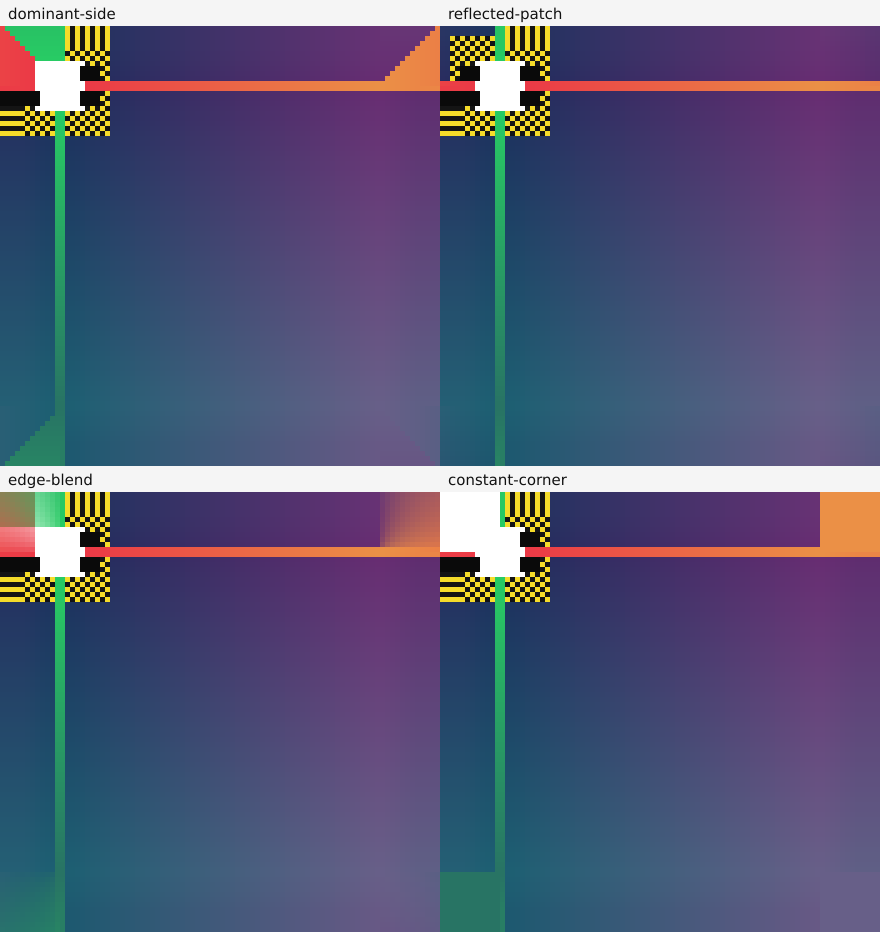

# ADR 0003: Raster bleed corners and vector SVG policy

- Status: Accepted
- Date: 2026-09-24
- Scope: Phase 2 — Bleed Engine

## Context

The trim pixels must remain untouched. Edge strips can be extended one side at
a time, but the four corner blocks need their own rule so they join the top,
bottom, left, and right extensions without a visible seam. The plan also leaves
open how non-zero bleed should work for SVG while requiring the original vector
trim to remain vector.

## Corner spike

The isolated diagnostic in [`spikes/bleed-corners/run.cjs`](../../spikes/bleed-corners/run.cjs)
creates a high-contrast corner containing a checker, light and dark marks,
colored edges, and a smooth gradient. The four panels use the same source,
bleed width, and source strip; only the corner rule changes:

- **Dominant side:** selects the horizontal or vertical extension according to
  which outside distance is greater. The selection boundary creates a diagonal
  seam through the corner.
- **Reflected patch:** samples the small source corner patch by reflecting the
  outside X and Y distances inward. Its top and side boundaries use the same
  samples as their adjoining edge strips, so the joins are continuous.
- **Edge blend:** interpolates the two side samples. It hides a hard seam but
  mixes unrelated edge colors and blurs high-contrast details.
- **Constant corner:** repeats the corner pixel. It avoids a seam but produces
  a flat patch that can contrast with the adjacent stretched edges.

## Decision

Use the reflected corner patch for all four corners. TOP, BOTTOM, LEFT, and
RIGHT are generated independently from their own source strips. In each corner,
the X and Y distances select a pixel from the nearest local source patch. This
matches the adjoining side samples at both boundaries and only writes outside
the trim rectangle.

Use the same corner strategy for 8-bit and 16-bit raster images. Keep its name
and algorithm version in the deterministic derivative cache key. The preview
result exposes the trim rectangle and the derived raster so consumers can
display the original trim boundary without rebuilding the image.

For a non-zero bleed request on SVG, fail explicitly in this phase. The
accepted PDF SVG path handles a conservative set of direct-child shapes and
rejects nesting, clipping, filters, text, and other constructs that would be
needed to safely clone and clip arbitrary edge content. Rasterizing the whole
SVG would violate the vector-trim requirement, while rasterizing only its edge
would add an unselected raster resolution. A later SVG-specific spike may add a
validated vector extension path. Zero bleed continues to pass the original SVG
through unchanged.

## Consequences

- No source pixel inside the trim rectangle is resized, sampled, or rewritten.
- The corner patch can mirror a small amount of edge detail into the discardable
  bleed region; the chosen source strip limits how much detail is copied.
- Raster output remains PNG and lossless after decoding, including alpha and
  16-bit PNG samples. JPEG is decoded only for non-zero bleed; its derivative is
  never JPEG.
- SVG remains vector and untouched at zero bleed. Non-zero SVG bleed reports an
  explicit unsupported-operation error instead of silently rasterizing.

## References

- [Implementation plan, Image Engine and bleed algorithm decision](../../IMPLEMENTATION_PLAN.md#parte-vii--image-engine)
- [Reproducible corner spike source and image](../../spikes/bleed-corners/)
