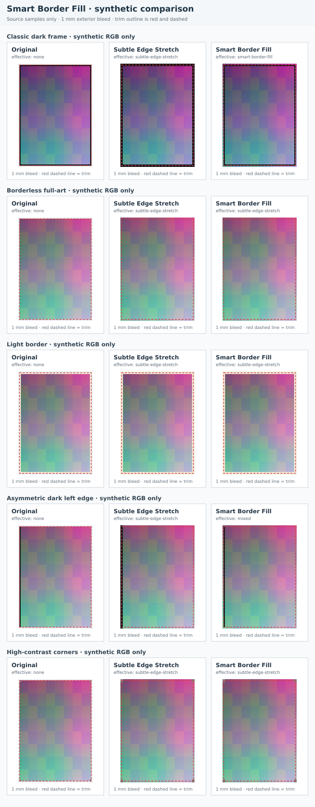

# ADR 0007: Smart Border Fill for raster bleed

- Status: Accepted
- Date: 2026-09-26
- Scope: Phase 5.5, Front B — Scryfall raster bleed

## Context

The existing `subtle-edge-stretch` mode preserves the trim but samples the
physical outside edge of the source. On a Scryfall scan with a flat dark frame,
that can extend a black strip into the PDF bleed. The correction must keep the
physical trim and the existing `BleedEngine`/PDF boundary intact. It must also
fall back when pixel evidence cannot distinguish a frame from artwork.

## Decision

`BleedEngine` remains the sole bleed generator. It now accepts
`smart-border-fill` alongside `subtle-edge-stretch`. Providers supply artwork
metadata only; they do not classify pixels or generate derivatives. Smart mode
classifies top, right, bottom, and left independently and can use a different
source-strip offset on each side.

The automatic policy is centralized in `resolveBleedSourcePolicy`:

| Selected artwork | Automatic mode | Policy identity |
| --- | --- | --- |
| Scryfall raster | `smart-border-fill` | `scryfall-raster-auto-v1` |
| Scryfall with an unrecognized non-SVG format | `subtle-edge-stretch` | `scryfall-unknown-format-subtle-v1` |
| Local upload | `subtle-edge-stretch` | `local-raster-subtle-v1` |
| MPC without trusted trim/bleed metadata | `subtle-edge-stretch`, explicitly marked unknown | `mpc-metadata-unknown-conservative-v1` |
| URL or custom raster | `subtle-edge-stretch` | source-specific subtle policy |
| SVG | Existing vector rules | `svg-vector-preserved-v1` |

The export control and `/api/cards/export` accept `auto`, `smart-border-fill`,
or `subtle-edge-stretch`. An explicit choice overrides the source default. SVG
still passes through unchanged at 0 mm and still reports the existing explicit
unsupported-operation error for non-zero bleed.

## Classification and inward search

Thresholds are centralized under
`SMART_BORDER_FILL_CONFIG_VERSION = "smart-border-fill-thresholds-v1"`.
Values are normalized to 0–1 unless marked in millimeters or samples.

| Setting | Default | Use |
| --- | ---: | --- |
| `classificationStripMm` | 0.75 mm | Maximum width of the outer band sampled for the dark-frame check; capped by the requested source-strip width |
| `darkLuminanceMax` | 0.20 | Maximum mean Rec. 709 luminance for a dark band |
| `darkPixelLuminanceMax` | 0.14 | Per-pixel luminance counted as dark |
| `minimumDarkPixelFraction` | 0.85 | Minimum dark-pixel fraction for a low-variation outer frame |
| `maximumDarkPixelFractionForInteriorStrip` | 0.10 | Maximum dark-pixel fraction for accepting an inward source strip |
| `maximumLuminanceStdDev` | 0.045 | Maximum luminance variation for a uniform dark frame |
| `maximumColorStdDev` | 0.07 | Maximum average per-channel variation for a uniform dark frame |
| `minimumSamples` | 12 | Minimum visible samples after transparent pixels are ignored |
| `inwardSearchBoundMm` | 2 mm | Maximum physical depth of the leading edge of an inward candidate strip |
| `searchStepMm` | 0.25 mm | Distance between inward candidate strips |

The engine converts the configured millimeter distances using each source
dimension and the fixed trim size, 63.5 × 88.9 mm. Each edge samples the central
90% of its length, skipping 5% at each corner so corner pixels do not drive the
classification. Alpha values at or below 5% are ignored. Luminance and color
variation are measured from normalized 8-bit or 16-bit samples.

The outer source band is a frame only when its mean luminance, dark-pixel
fraction, luminance deviation, and color deviation all meet the configured
thresholds. The search then advances by the configured step. A candidate is
accepted only if its mean luminance is above the dark limit and no more than
10% of its pixels are dark. The leading edge of a candidate strip must be
within the configured physical search bound; the strip width itself can extend
farther inward. The existing requested source-strip width limits how much of
the card is copied into the bleed.

## Fallback and corner behavior

If the outer band is not confidently dark and uniform, the side uses
`subtle-edge-stretch` with fallback reason
`outer-band-not-dark-uniform`. If a qualifying inner strip is not found within
the bound, the side falls back with reason
`no-representative-interior-strip-within-search-bound`. A failed side does not
change the decisions for the other three sides. Results report the requested
mode, each side's effective mode and source-strip offset, classification, and
fallback reason. The overall result reports `mixed` when sides use different
modes.

`addRasterBleed` writes only outside the trim rectangle. The trim samples are
copied directly. For each corner, the X and Y samples use the independently
selected adjacent side strips and the same strip-to-bleed mapping as those
sides. Near each end of a side extension, its along-edge source coordinate is
clamped to the neighboring side offset so both adjoining corner boundaries
sample the same pixels, even when one side falls back and the other uses an
inward strip. This preserves the reflected-corner join invariant from
[ADR 0003](0003-bleed-algorithm.md).

The result remains a lossless PNG derivative. The original trim is overlaid
once by the PDF engine, and the generated `BleedResult.preview.bytes` are the
same bytes it embeds in the clipped outside-trim regions. The existing PDF path
continues to place guides and trims at the nominal 63.5 × 88.9 mm size, with no
downsampling. Zero millimeters remains original-byte passthrough. Tests cover
exact trim samples, 16-bit RGBA and alpha, supported bleed widths, and the
existing JPEG, PNG, and SVG paths.

## Versioning and cache identity

The algorithm version is
`reflected-corners-v2-smart-border-fill-v1`. `createBleedCacheKey` hashes the
source SHA-256, requested bleed, requested mode, source-policy identity, source
strip, physical trim dimensions, algorithm version, and the complete
versioned threshold configuration. `CardExportService` uses the same key helper
for its per-export derivative de-duplication, so identical bytes chosen through
different policies or modes cannot reuse the wrong derivative.

## MPC metadata gap

The current MPC artwork provider is reference-only: imported references have no
local image bytes and do not carry trustworthy trim bounds or bleed state. The
export path continues to reject a reference without validated original bytes.
If an MPC raster original becomes available without trusted bleed metadata, the
automatic policy labels that state as unknown and uses subtle edge stretch. It
does not mark the image already bled, crop it, or require smart fill. The user
can explicitly select either mode through the export UI or API. Implementing an
MPC provider or changing importer XML is outside this decision; obtaining
reliable MPC trim/bleed metadata remains unresolved.

## Synthetic visual review

The matrix below compares original, subtle, and smart output at 1 mm for five
generated RGB fixtures: a classic dark frame, borderless/full-art texture, light
border, asymmetric left frame, and high-contrast corners. No commercial card
artwork is used. The red dashed rectangle marks the trim; the original column
uses a neutral pad outside the source only to keep panel dimensions equal.

For the classic synthetic frame, `subtle-edge-stretch` extends the dark frame;
`smart-border-fill` selects the inner color field on all four sides. The
borderless, light-border, and high-contrast-corner fixtures fall back to subtle
stretch; the asymmetric fixture uses smart fill on its dark left edge and
subtle fallback on the other sides. The reproducible renderer is
[`spikes/smart-border-fill/render-matrix.cjs`](../../spikes/smart-border-fill/render-matrix.cjs).

## Consequences

- Scryfall raster artwork with a dark, uniform edge can use a nearby inner
  source strip without changing the physical trim.
- Every Scryfall raster requests `smart-border-fill` automatically, including
  borderless/full-art metadata. Pixel-only evidence determines each side; the
  borderless/full-art fixture falls back when its edges are not confidently
  dark and uniform.
- Preview bytes and PDF output share one `BleedResult` and one effective policy.
- MPC trim/bleed state stays explicitly unknown until trustworthy metadata is
  available.
- Changing any threshold requires a new or changed cache identity; changing
  the algorithm requires updating `BLEED_ALGORITHM_VERSION`.
